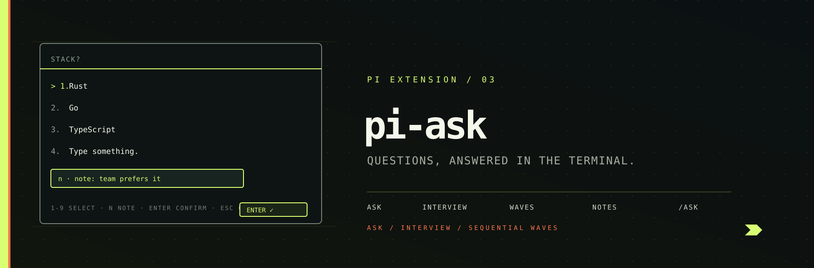

<p align="center">
  
</p>

# pi-ask - interactive Q&A for pi.dev

Multiple choice and single answer questions with **notes** and **custom answers**,
Claude Code style. When the agent needs input - requirements, preferences,
decisions - it calls the `ask` / `interview` tools and the question is
rendered as a full-screen picker in the terminal. The developer answers with a
**number key**, the **arrow keys**, or types a **custom answer**; a **note** can
be attached to any answer with `n`.

## Install

```bash
pi install npm:@pixu1980/pi-ask
```

Requires **Node.js ≥ 22** (uses `--experimental-strip-types`).

## What you get

| Resource | What it does |
|---|---|
| `ask` tool | One question: options + custom answer + optional note + optional multi-select - also covers sharp plan interviews (recommended answers, codebase exploration) |
| `interview` tool | A batch of questions as **sequential questionnaires** with tab navigation, a review tab before submit, and **caller-controlled waves** of any length (respected in full); the "con dominio" variant adds domain-aware interviews (CONTEXT.md / ADR) |
| `/ask <topic>` | Command that tells the model to ask you a single question (or run a sharp plan interview) |
| `/ask-interview <topic>` | Command that tells the model to run a structured interview / questionnaire; append "con dominio" or `--docs` for a domain-aware interview |
| Auto-trigger | Phrases like "fammi una domanda", "fammi un questionario", "sfida il piano", or "intervistami col dominio" route into the matching mode automatically |

The tools are callable by the model automatically (no setup). The slash
commands make the "interview mode" flow explicit.

## How answering works

When the model calls `ask`, the editor is temporarily replaced by the question
picker:

```
────────────────────────────────────────────────────────────────────────────
 Which stack?

> ✓ 1. Rust
    2. Go
    3. TypeScript
   4. Type something.

 Enter submit • n note • ↑↓ change • Esc back
────────────────────────────────────────────────────────────────────────────
```

| Key | Action |
|---|---|
| `1`-`9`, `0` | Jump the highlight (1-9, 0 = 10th) - quick-select submits in single mode |
| `↑` / `↓` | Move the highlight (a highlighted option is always present) |
| `Enter` | **Confirm the highlighted option** (submits / advances) |
| `n` | Open the note editor - the note travels with the confirmed answer |
| `Space` | Toggle the highlighted checkbox (multi-select mode) |
| `Esc` | Close editor → cancel |

Answering is **instant**: the highlighted option + `Enter` confirms - no
confirmation step. **"Type something." enters write mode as soon as it is
highlighted** (arrow down to it); navigating away clears the field.

### Single vs multi select

- **Single (default):** pick one option - or "Type something." for a custom
  answer. Selection submits immediately.
- **Multi (`multiSelect: true`):** toggle options with `Space` or digits,
  add a note with `n`, submit with Enter.

### Notes

Press `n` **before** selecting to open the note editor; the note is attached
to the next answer you pick. The note travels with the answer back to the model:

```
Q1: 1. Frontend - note: team prefers it
```

## Interview

The `interview` tool renders a tab bar: one tab per question (labels chosen by
us) plus a **Submit** tab. Move between tabs freely with `←` / `→`
(or Tab / Shift+Tab) - questions can be answered in any order. Answer a question
with a digit (records and advances to the next tab) or by highlighting an option
with `↑` / `↓` and pressing `Enter`. Enter records the highlighted option (or the
current multi-selects) and **advances to the next question**; on the last
question it lands on the Submit tab, where Enter submits everything. Unanswered
questions are listed on the review screen, and answers can be edited by tabbing
back.

### Waves (caller-controlled structure)

Long interviews are broken into **sequential questionnaires**: each wave
renders on its own with a header (`Questionnaire 1/2`, `Questionnaire 2/2`)
and its own review + Submit step - the next questionnaire only starts after
you confirm the previous one.

The caller controls the grouping: pass `waves` with a label and **any number
of questions per wave** (decided by hierarchical or structural criteria -
sections, difficulty, phases). Each wave is respected in full, never split,
so a 20-question baseline stays one questionnaire if that is how you
structured it.

### Waves

Pass `waves` to the `interview` tool when the questionnaire spans phases
measured at different points in time (e.g. a baseline and a follow-up). Each wave is a labelled group of questions with any
length - the caller decides the grouping by hierarchical/structural criteria;
waves are rendered one after the other as sequential questionnaires:

```json
{
  "title": "Progetto di ricerca",
  "waves": [
    { "label": "Wave 1 - Baseline",  "questions": [ { "id": "w1q1", "prompt": "...", "options": [...] }, ... ] },
    { "label": "Wave 2 - Follow-up", "questions": [ { "id": "w2q1", "prompt": "...", "options": [...] }, ... ] }
  ]
}
```

Each wave renders as its own questionnaire: a header shows the wave label
(e.g. "Wave 1 - Baseline"), and answers carry the wave label in the final
result so the two waves can be compared. A flat `questions` list is treated
as a single unlabelled wave.

## Slash commands & auto-trigger

- `/ask <topic>` - single-question mode about a topic. Also handles sharp plan interviews:
  when you ask to sharpen a plan, the model asks one question at a time with
  recommended answers and codebase exploration.
- `/ask-interview <topic>` - structured interview (multi-question, sequential
  questionnaires, optional waves) about a topic. Append "con dominio" or
  `--docs` for a domain-aware interview against CONTEXT.md glossary, ADRs and
  the code.

The same modes activate automatically from natural language, so you do not
have to remember the commands:

| You write | Mode |
|---|---|
| "fammi una domanda", "chiedimi qualcosa", "ask me one question" | `/ask` |
| "intervistami", "fammi un questionario", "due wave di domande" | `/ask-interview` |
| "intervistami sul piano", "sfida il piano", "stress-test il piano" | `/ask` (sharp) |
| "intervistami col dominio", "contro il domain model" | `/ask-interview` (docs) |

## Guardrails

When your prompt signals ask / interview intent, pi-ask appends a
**mandatory directive to the system prompt** (via `before_agent_start`) that
forces the model to drive the session through the `ask` / `interview` tool
instead of replying with plain-text questions. The guardrail lives inside the
extension, so it is active **only when pi-ask is installed**.

## Non-interactive modes

In `-p` / `--mode json` / `--mode rpc` the tools degrade gracefully: they
return the question and options without an answer so the model can adapt.

## Example: requirements interview

```
you: /ask-interview new CLI tool
pi:  Which language?                    → 1. TypeScript  2. Rust  3. Go  4. Python
     (n) note: "team is Rust-first"
pi:  How will it be distributed?        → 1. npm  2. Homebrew  3. cargo  4. binary tarball
pi:  Got it: TypeScript-first CLI... (summarizes and starts working)
```

## Development

```bash
cd packages/pi-ask
pnpm test          # unit + UI tests (fake TUI driver)
pnpm exec tsc --noEmit   # strict type check
pi -e .            # run pi with the extension loaded locally
```

## License

MIT
