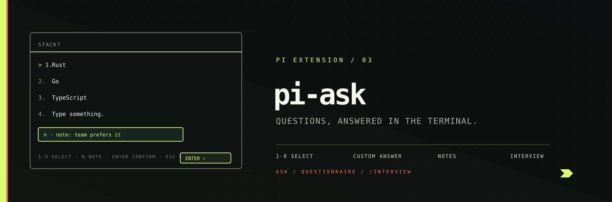

<p align="center">
  
</p>

# pi-ask — interactive Q&A for pi.dev

Multiple choice and single answer questions with **notes** and **custom answers**,
Claude Code style. When the agent needs input — requirements, preferences,
decisions — it calls the `ask` / `questionnaire` tools and the question is
rendered as a full-screen picker in the terminal. The developer answers with a
**number key**, the **arrow keys**, or types a **custom answer**; a **note** can
be attached to any answer with `n`.

## Install

```bash
pi install npm:@pixu1980/pi-ask
```

Requires **Node.js ≥ 22** (uses `--experimental-strip-types`).

## What you get

| Resource | What it does |
|---|---|
| `ask` tool | One question: options + custom answer + optional note + optional multi-select |
| `questionnaire` tool | A batch of questions with tab navigation and a review tab before submit |
| `/interview <topic>` | Command that tells the model to interview you, one question at a time |
| `interview` skill | Guidelines the model follows when it asks you questions |

The tools are callable by the model automatically (no setup). The `/interview`
command and the skill make the "interview mode" flow explicit.

## How answering works

When the model calls `ask`, the editor is temporarily replaced by the question
picker:

```
────────────────────────────────────────────────────────────────────────────
 Which stack?

> ✓ 1. Rust
    2. Go
    3. TypeScript
   4. Type something.

 Enter submit • n note • ↑↓ change • Esc back
────────────────────────────────────────────────────────────────────────────
```

| Key | Action |
|---|---|
| `1`-`9`, `0` | Jump the highlight (1-9, 0 = 10th) — quick-select submits in single mode |
| `↑` / `↓` | Move the highlight (a highlighted option is always present) |
| `Enter` | **Confirm the highlighted option** (submits / advances) |
| `n` | Open the note editor — the note travels with the confirmed answer |
| `Space` | Toggle the highlighted checkbox (multi-select mode) |
| `Esc` | Close editor → cancel |

Answering is **instant**: the highlighted option + `Enter` confirms — no
confirmation step. **"Type something." enters write mode as soon as it is
highlighted** (arrow down to it); navigating away clears the field.

### Single vs multi select

- **Single (default):** pick one option — or "Type something." for a custom
  answer. Selection submits immediately.
- **Multi (`multiSelect: true`):** toggle options with `Space` or digits,
  add a note with `n`, submit with Enter.

### Notes

Press `n` **before** selecting to open the note editor; the note is attached
to the next answer you pick. The note travels with the answer back to the model:

```
Q1: 1. Frontend — note: team prefers it
```

## Questionnaire

The `questionnaire` tool renders a tab bar: one tab per question (labels chosen
by the model) plus a **Submit** tab. Move between tabs freely with `←` / `→`
(or Tab / Shift+Tab) — questions can be answered in any order. Answer a question
with a digit (records and advances to the next tab) or by highlighting an option
with `↑` / `↓` and pressing `Enter`. Enter records the highlighted option (or the
current multi-selects) and **jumps straight to the Submit tab**; on the Submit
tab, Enter submits everything. Unanswered questions are listed on the review
screen, and answers can be edited by tabbing back.

## Non-interactive modes

In `-p` / `--mode json` / `--mode rpc` the tools degrade gracefully: they
return the question and options without an answer so the model can adapt.

## Example: requirements interview

```
you: /interview new CLI tool
pi:  Which language?                    → 1. TypeScript  2. Rust  3. Go  4. Python
     (n) note: "team is Rust-first"
pi:  How will it be distributed?        → 1. npm  2. Homebrew  3. cargo  4. binary tarball
pi:  Got it: TypeScript-first CLI... (summarizes and starts working)
```

## Development

```bash
cd packages/pi-ask
pnpm test          # unit + UI tests (fake TUI driver)
pnpm exec tsc --noEmit   # strict type check
pi -e .            # run pi with the extension loaded locally
```

## License

MIT
