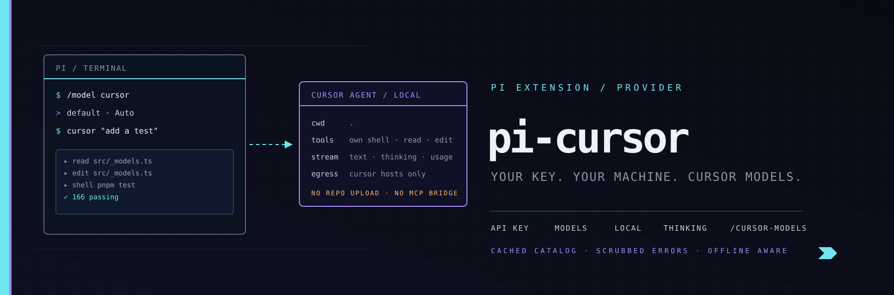

<p align="center">
  
</p>

# pi-cursor

> Cursor API key provider for [pi](https://pi.dev) — run Cursor agents from pi with **your own** Cursor API key.

```bash
pi install npm:@pixu1980/pi-cursor
```

## Why this exists

`pi-cursor-sdk` (upstream, by Mitch Fultz) is a thorough Cursor provider, but it
ships ~110 source files, an MCP tool bridge, a cloud-agent runtime, a usage
reporting path and a 40-script smoke harness. `pi-cursor` is the small,
auditable core: the Cursor API key, the Cursor models, and nothing else.

What the reduction dropped: cloud agents, the MCP tool bridge that exposed pi's
tools over loopback HTTP, cloud usage reporting, the SDK key-fingerprint the
upstream cache stored, and alias-based model ids.

## Features

- **`cursor` provider** — all Cursor models in pi's `/model` picker, discovered
  live from Cursor and cached locally for fast startup.
- **`/login cursor`** — paste your Cursor API key once; pi stores it in
  `~/.pi/agent/auth.json` (mode 0600), like every other provider.
- **Thinking levels** — Cursor's `effort` / `reasoning` / `thinking` parameters
  mapped onto pi's `off … max` levels, so `/think` works.
- **Context and speed variants** — `grok-4.6@200k`, `grok-4.6:fast`.
- **Local agents only** — the Cursor agent runs on your machine, in your cwd.
  No cloud agents, no PR creation, no repo upload.
- **No telemetry added by this extension** — zero requests are issued by
  pi-cursor itself. See [Egress](#egress).

## Install

```bash
pi install npm:@pixu1980/pi-cursor
```

Then, inside pi:

```
/login cursor          # paste your Cursor API key
/model                 # pick a Cursor model
```

Or use the environment variable instead of `/login`:

```bash
export CURSOR_API_KEY="..."   # machine-local only, never written by the extension
```

## Commands

| Command | What it does |
| --- | --- |
| `/cursor-models` | Refresh the live Cursor model catalog without restarting pi |
| `/cursor-egress` | Print the audited outbound surface and the backend-override state |
| `/cursor-key` | Print which key source is active, masked (`crsr…89 (48 chars)`) — never the key |

## Configuration

| Variable | Default | Effect |
| --- | --- | --- |
| `CURSOR_API_KEY` | — | API key fallback when nothing is stored via `/login cursor` |
| `PI_CURSOR_DISABLE_MODEL_CACHE` | `0` | `1` disables the catalog cache |
| `PI_CURSOR_MODEL_CACHE_TTL_MS` | `21600000` (6h) | Catalog cache freshness |
| `PI_CURSOR_LOG_EGRESS` | `0` | `1` prints the outbound surface to stderr at startup |
| `PI_CURSOR_ALLOW_BACKEND_OVERRIDE` | `0` | `1` permits `CURSOR_BACKEND_URL` outside the allowlist |
| `CURSOR_SDK_LOCAL_MODEL_CATALOG_JSON` | set by pi-cursor | Catalog `@cursor/sdk` validates local model selections against. pi-cursor publishes the catalog it resolved; a value you set yourself is left untouched. |

## Plans and model availability

Cursor's *Cloud Agent* API (`GET https://api.cursor.com/v1/models`) is what
`Cursor.models.list()` reads, and it answers `403 [plan_required]` on a **Free**
plan. pi-cursor still works there:

- **Model catalog.** When the live fetch is refused the extension keeps its local
  catalog, which includes **Auto** (`default`) — the one model a Free plan may
  select. Named models (`grok-4.6`, `composer-2`, …) stay listed and are rejected
  by Cursor's own backend with a clear message if your plan cannot use them.
- **Local agent validation.** `@cursor/sdk` validates a local agent's model by
  calling that same Cloud endpoint, and treats a validation failure as fatal. At
  startup pi-cursor therefore exports `CURSOR_SDK_LOCAL_MODEL_CATALOG_JSON` (the
  SDK's own override) with the catalog it resolved, so validation happens
  in-process and never blocks a local run.
- **Quiet startup.** A `plan_required` refusal is the *expected* answer on a
  Free plan, so it prints nothing: the local catalog is kept and pi starts
  normally. Run `/cursor-models` for the refusal on an explicit refresh —
  `UnknownAgentError: [plan_required] … (code=plan_required, status=403)`. Any
  other discovery failure still prints one startup line naming the real error
  instead of the bare SDK error class.

Named models and the cloud endpoints need a paid Cursor plan; Auto is
available on every plan.

## Egress

pi-cursor ships **no HTTP client of its own** — there is no `fetch`, no
`http.request`, no third-party networking package. Everything on the wire is the
Cursor SDK, driven from three call sites:

| Host | Who calls it | What goes there |
| --- | --- | --- |
| `api2.cursor.sh` | Cursor SDK | API key exchange, agent run stream, model catalog, SDK run counters |
| `api.cursor.com` | Cursor SDK | Model catalog |

Call sites: `Cursor.models.list()` (model discovery), `Agent.create()` (one
local agent per pi session), `agent.send()` (one run per turn).

The catalog `@cursor/sdk` uses to validate a **local** model selection is
supplied by pi-cursor through `CURSOR_SDK_LOCAL_MODEL_CATALOG_JSON`, so the SDK
issues no `GET /v1/models` of its own for validation.

Your API key travels as a `Authorization: Bearer …` header to those two hosts
and nowhere else. Two guards back that up:

- `CURSOR_BACKEND_URL` is **refused** unless it resolves inside the allowlist,
  so a stray shell export cannot redirect your key to a third party. Opt in
  with `PI_CURSOR_ALLOW_BACKEND_OVERRIDE=1` if you run your own Cursor backend.
- Every string that can reach the transcript, an error, or stderr is scrubbed
  first, so the key cannot be echoed back by the SDK or by a failing request.
- **`--offline` is honoured.** The Cursor SDK issues its own requests and does
  not read pi's offline flag, so pi-cursor checks `PI_OFFLINE` itself and skips
  startup model discovery entirely: an offline run makes no request at all.
  `/cursor-models` refuses too, instead of quietly sending your key.

Run `/cursor-egress` at any time to see the current state, or read
[`DISCLOSURE`](./DISCLOSURE) for the precise statement.

## How turns are handled

The Cursor SDK runs a self-contained agent: **it** executes shell, read, edit and
search against your working directory. pi therefore treats a Cursor turn as a
single unit and shows the agent's tool activity as a display-only trace, rather
than handing pi `toolCall` blocks it would then execute a second time.

Consequence worth knowing: **pi's tool approval prompts do not apply to the
Cursor agent's own tools.** The agent runs with the permissions of the pi
process. If you need pi's tool layer in the loop, upstream `pi-cursor-sdk`'s MCP
bridge is the design you want.

Context handoff: on the first turn of a pi session the whole transcript is
handed to a freshly created Cursor agent; afterwards only the newest user
message is sent, because the agent already holds the earlier turns.

## Development

```bash
cd packages/pi-cursor
pnpm install
pnpm test        # 166 tests
pnpm typecheck   # tsc --noEmit
```

The suite covers the security invariants directly: the egress allowlist, the
refusal of a redirected backend, key scrubbing, the no-write guarantee for key
material, the cache containing no key-derived value, and a source-level audit
that fails if anyone adds a network API or a non-Cursor URL literal.

## Security

This package carries your Cursor API key and is declared `dual-use`. Its
`DISCLOSURE` states exactly what it can reach and what it writes, and
[SECURITY.md](../../SECURITY.md) covers how to report a problem privately.

## Credits

Inspired by [`pi-cursor-sdk`](https://github.com/fitchmultz/pi-cursor-sdk)
(`MIT`, Mitch Fultz), which established the model-identity scheme and the
delta-to-pi stream mapping this extension follows.

## License

`MIT`
