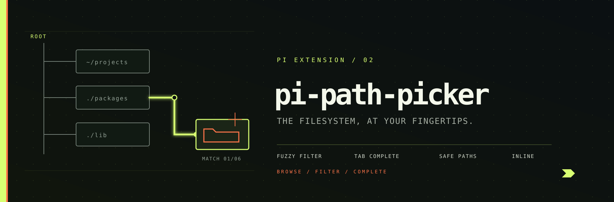

<p align="center">
  
</p>

# pi-path-picker - pi.dev extension

Interactive file path autocomplete inside the TUI prompt.  
Tab-complete `~`, `/`, `./`, `../` paths - only inside quotes (`"`, `'`, `` ` ``).  
Tab on a **folder** shows its **complete** contents; Tab on a **partial
name** filters by prefix.

No `/pick` command. No external tool. Pure inline completion.

## Install

```bash
pi install npm:@pixu1980/pi-path-picker
```

Requires **Node.js ≥ 22** (uses `--experimental-strip-types`).

## Interaction modes

Path autocomplete fires **only on Tab**, inside a quoted context (a pair of double quotes, single quotes, or backticks — the pair may be **open** or **closed**), and only when the quoted path token contains `/`.

The extension adds no trigger characters of its own. When no quoted context is present it delegates transparently to pi's native provider, so built-in commands (`/model`, `/settings`, `/caveman`, etc.), `@file`, command arguments, and native Tab completion behave exactly as if `pi-path-picker` were not installed.

Non-Tab typing inside quotes is also delegated: the native `@`-attachment fuzzy completion keeps working inside quotes. Tab over a quoted token without a path (or with `~` alone) returns no suggestions, closing any stale menu without involving the native provider.

### 1. `~` / `~/` - Home directory expansion

Type `~/` inside quotes and press Tab → file list from `$HOME`. The pair can be still open (the natural way of typing) or already closed with the cursor right after the closing quote.

```
"~/|" + Tab        →  shows home-directory contents
"~/.ssh/|" + Tab   →  suppressed (sensitive directory guard)
```

### 2. `/` - Absolute path browsing

Type `/` inside quotes and press Tab → list filesystem root contents.

```
"/|" + Tab         →  root contents
"/etc/ssh/|" + Tab →  suppressed (sensitive directory guard)
```

### 3. `./` and `../` - Relative path browsing

Type `./` or `../` inside quotes and press Tab → navigate from project root or parent directories.

```
"./src/|" + Tab    →  contents of ./src/
"../../|" + Tab    →  contents two levels above
```

### 4. Tab key - Force trigger

Tab is the **only** path-picker trigger. It opens the menu when:

1. the cursor is inside a quote region of `"`, `'`, or `` ` ``: an open pair (opening quote typed, no closing quote yet), a closed pair with the cursor between the delimiters, or a closed pair with the cursor right after the closing quote (the path token lives between the delimiters);
2. the extracted path token contains `/` (`~/`, `/`, `./`, `../`, or a descendant path).

Typing `~`, `/`, a quote, or a backtick never opens the path menu by itself.

### 5. What Tab shows

The menu depends on the shape of the quoted token:

- **Directory token** (`./`, `./src/`, `~/.../`) + Tab → the **complete
  contents** of that folder: every file and directory, hidden entries
  (`.git`, `.env`, …) included, no cap.
- **Partial name** (`./f`, `./src/ma`) + Tab → only the entries matching
  that prefix (case-insensitive). Hidden entries appear when your partial
  name starts with `.` (e.g. `./.g` → `.git`).

The list is always scrollable (`↑↓`). There is no hidden detailed mode to
unlock on a second Tab — what you see on the first Tab is everything.

Entries whose name contains control characters (like the macOS Finder
folder-icon artifact `Icon\r`) are skipped: they would render as empty,
blank rows and their value would inject control codes into the prompt.

```
"./|"  + Tab   →  everything inside `./` (files, folders, dotfiles)
"./f|" + Tab   →  only `./f*` entries
"./.g|" + Tab  →  hidden entries starting with `.g`
```

### 6. Applying a completion

The list opens on the first Tab: complete contents for directory tokens,
prefix-filtered for partial names. It is scrollable (`↑↓`).

- **Tab again** (or **Enter**) applies the selected entry; a directory keeps
  its trailing `/` so you can keep completing inside it.
- When the pair is still open the completion extends the quoted token
  (`"./foo` stays inside the quotes); when the pair was already closed the
  closing quote is preserved (`"./foo"`).

```
"./|"  + Tab      →  complete contents of `./` (files, folders, dotfiles)
"./f|" + Tab      →  filtered `./f*` entries
"./f…  + Tab (again) →  applies the selected entry
```

Typing anything or moving the cursor re-runs the list on the next Tab
(complete or filtered, depending on the token). The sensitive-directory
guard still applies. There is deliberately no “Tab twice = detailed mode”:
the pi editor applies the selection on the second Tab instead of
re-querying, so a hidden-files mode keyed on repeated Tabs cannot work there.

### 7. Paths with spaces

Fully supported. The extension captures the entire text between quotes, including spaces,
so paths like `"./My Projects/"` complete correctly.

## Sensitive directory guard

These directories are blocked from listing to prevent accidental exposure:

| Path |
|---|
| `~/.ssh` |
| `~/.aws` |
| `~/.config/gh` |
| `~/.gnupg` |
| `~/.password-store` |
| `~/.kube` |
| `/etc/ssh` |

Users can still navigate into them via other means - only the autocomplete list is suppressed.

## How it works

The extension registers an **autocomplete provider** via pi's `session_start` hook.
It wraps pi's native provider and adds path-aware completion.

### Autocomplete isolation contract

The provider follows one ownership rule:

1. **No custom trigger characters** - the wrapper passes through the native provider's trigger list unchanged.
2. **Inside a quote region + Tab + token containing `/`** - `pi-path-picker` owns suggestions and completion. A quote region is the text between an opening delimiter and its closing delimiter; it includes the two states the real editor produces: the open pair (`"./` — the natural typing position) and the closed pair with the cursor right after the closing quote (`"./"`), where the path token lives between the delimiters.
3. **Inside a region without Tab** - delegates to the native provider, so the native `@`-attachment fuzzy completion inside quotes keeps working.
4. **Inside a region whose token has no slash (or no token at all)** - returns no suggestions, closing any stale menu without involving the native provider.
5. **No quote region** - delegates `getSuggestions`, `shouldTriggerFileCompletion`, and `applyCompletion` to the wrapped native provider without altering arguments or results.

This delegation is required because `addAutocompleteProvider()` creates a wrapper chain: returning `null` outside the owned context would stop native slash-command completion.

Inside quote regions, the extension resolves paths against `cwd` or `$HOME`, lists the target folder (complete contents when the token is a directory, prefix-filtered when it is a partial name — hidden entries included in complete listings or when the prefix starts with `.`), and returns autocomplete items with `📁` / `📄` labels. The menu has no cap. The sensitive-directory guard still applies.

## Development

```bash
# From monorepo root
cd packages/pi-path-picker
pi -e .         # Test locally
node pick-path.test.cjs        # Run standalone CLI tests
node --import tsx --test __tests__/index.test.mjs  # Run the extension test suite
```

## Files

| File | Role |
|------|------|
| `index.ts` | Extension entry - registers autocomplete provider via `session_start` |
| `lib/_pick-path.ts` | Standalone helper - interactive TUI browser (`--quick` for glob), used by the extension internally |

## Pick-path CLI (`lib/_pick-path.ts`)

The helper script can also run standalone as a terminal UI:

```bash
node --experimental-strip-types lib/_pick-path.ts              # Interactive browser
node --experimental-strip-types lib/_pick-path.ts --quick *    # Quick glob match (stdout)
echo "src" | node --experimental-strip-types lib/_pick-path.ts # Pipe start directory
```

Keys inside the interactive browser:

| Key | Action |
|-----|--------|
| `↑↓` | Navigate |
| `↵` | Select file / select directory |
| `⭾` | Enter directory |
| `←` | Go up to parent |
| `⎋` | Cancel |
| Type | Fuzzy filter |
| `⌫` | Clear filter |

## License

MIT
