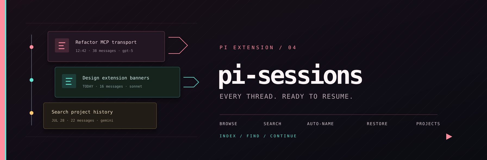

<p align="center">
  
</p>

# pi-sessions

Session history overlay for [pi.dev](https://pi.dev). Browse, search, and restore past sessions with auto-naming based on chat content.

**Screenshot idea:** A centered modal listing past sessions with auto-names, dates, message counts, and model info.

## Features

- **📋 Session browser** - Centered modal, matching `/mcp`, shows all past sessions
- **📁 Project overview** - `/projects` groups sessions by project directory with aggregated metadata
- **🏷️ Auto-naming** - Sessions are named from the first user message content
- **🔍 Search/filter** - Type to filter by name, model, or project path
- **↕️ Keyboard navigation** - ↑↓ arrows, Home/End, PageUp/PageDown
- **⏪ One-click restore** - Select a session to load it with full context
- **📊 Session details** - Date, message count, model used, provider
- **📁 Folder first** - Each session shows the project directory prominently
- **💬 Last message** - Shows the last user message instead of just the first one

## Install

```bash
pi install npm:@pixu1980/pi-sessions
```

## Usage

### Session list

```
/sessions
```

Shows all sessions in a flat list with folder, last message, and metadata.

### Project overview (drill-down)

```
/projects
```

Shows sessions grouped by project directory with aggregated info:
- Project path, latest message, session count, total messages, model used
- Select a project → drill-down to individual sessions
- Esc in drill-down returns to project list

### Navigation

| Key | Action |
|-----|--------|
| ↑ / ↓ | Navigate |
| Enter | Select session (flat) / Drill down (projects) |
| Type text | Filter by project, message, model |
| Backspace | Clear filter |
| Home / End | Jump to first/last |
| PageUp / PageDown | Scroll page |
| Esc | Close overlay / Go back (projects drill-down) |

### Auto-naming

The extension automatically names each session from the first user message, truncated to 60 characters.

Each session entry shows:

- **📁 Folder** - Project directory path
- **💬 Last message** - Last user message content (truncated)
- **📊 Metadata** - Relative date, message count, model, provider

### Project overview (`/projects`)

Groups sessions by project directory. Each project shows:

- **📁 Project path** - Project directory
- **💬 Latest message** - Last user message from the most recent session
- **📊 Aggregated metadata** - Session count, total messages, latest model

Select a project to drill down into its individual sessions.

## How it works

1. Opens a centered loading modal immediately
2. Scans `~/.pi/agent/sessions/` asynchronously with bounded concurrency
3. Parses each session to extract message previews, counts, model and provider
4. Reuses the same modal for search and selection
5. On selection, uses `ctx.switchSession()` to load the session

## License

MIT

## Author

[Emiliano 'pixu1980' Pisu](https://github.com/pixu1980)
