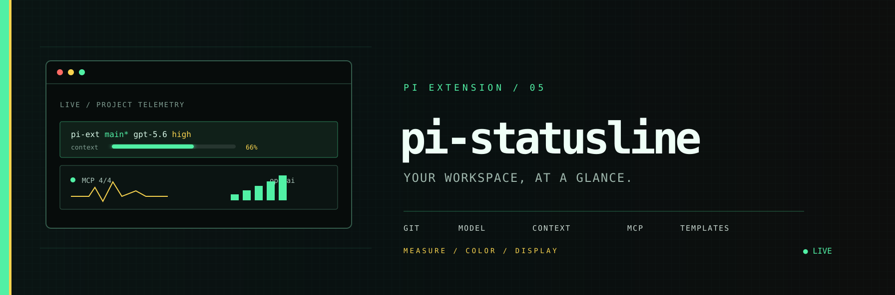

<p align="center">
  
</p>

# pi-statusline

> Statusline extension for [pi](https://pi.dev) - replicates `/statusline` from Claude Code with customizable templates, git status, model info, and context usage with gradient colors.

## Install

```bash
pi install npm:@pixu1980/pi-statusline
```

## Features

A dual-line status display for `pi-coding-agent`:

- **Line 1 (widget, below editor):** project name, git branch/status, model info, thinking level, and context usage with a gradient color scale.
- **Line 2 (footer, replaces native):** MCP server status on the left, provider/model info on the right.
- **Responsive auto format (default):** the widget re-measures the available width on every render and picks the most verbose layout that fits, degrading through four levels while preserving colors:
  - full: `Project: ~/…/my-app › Branch: main › Model: DeepSeek V4 Flash Effort: High › Context: 0/1.0M (0%)`
  - verbose: `P: ~/…/my-app › B: main › M: DeepSeek V4 Flash E: High › C: 0/1.0M (0%)`
  - compact: `P: my-app › B: main › M: DeepSeek V4 Flash - High › C: 0/1.0M`
  - minimal: `my-app | main | DeepSeek V4 Flash - High | 0/1.0M`

  The context separator (`/` between used and total) keeps the percentage gradient color at every level, even when the `(pct)` suffix is dropped.

  Switch the `Format` setting to `preset-full` / `preset-compact` / `preset-minimal` for a fixed layout, or `custom` for your own template.

## Commands

| Command | Description |
| --- | --- |
| `/statusline` | Print the current statusline in the output |
| `/statusline settings` | Open the interactive settings panel |
| `/statusline template` | Set a custom template string |
| `/statusline reload` | Reload settings from disk |

## Customization

Templates support placeholders for project, git branch, git status (ahead/behind/modified/untracked), model name, provider, thinking level, context usage, and MCP server counts. See the settings panel (`/statusline settings`) for the full list and live preview.

## License

MIT
