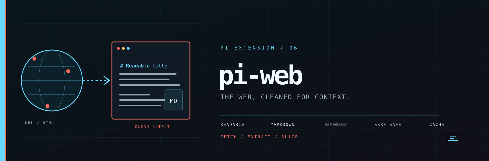

<p align="center">
  
</p>

# pi-web

Scrape any webpage into clean, context-ready **Markdown** for [pi.dev](https://pi.dev). Fetch one or more URLs, get readable Markdown with title/source metadata, and pull the rest of a long page in bounded slices - everything you need to drop web content straight into the conversation context.

> **Inspiration:** this package is inspired by [pi-web-access](https://github.com/nicobailon/pi-web-access) by Nicolás Bailon and uses the same extraction stack it popularized (`@mozilla/readability` + `turndown` + `linkedom`). pi-web focuses on the **fetch → Markdown** part only and intentionally drops the search-result "curator" browser UI: a scraper is synchronous and deterministic (ask for a page, get the page), so an interactive curation layer adds friction instead of value. Web search stays covered by pi-web-access / the built-in search tools.

## Install

```bash
pi install npm:@pixu1980/pi-web
```

## Tools

### `pi_web_fetch` - URL(s) → Markdown

Fetches one or more URLs, extracts the readable content with Readability, and converts it to Markdown with Turndown. The output is a Markdown document ready to drop into context:

```markdown
# The Readable Title

> Source: https://example.com/article · Fetched: 2025-08-01T12:34:56.789Z · 45210 chars

First paragraph with meaningful content.
...
---
[Showing 12000 of 45210 chars. Use pi_web_read({ id: "lxt3k...", offset: 12000 }) to read the next slice.]
```

Parameters:

| Param | Description |
|-------|-------------|
| `url` / `urls` | Single URL or array of URLs (fetched in parallel, concurrency-capped) |
| `raw` | Skip Readability and convert the whole page body - keeps tables and code blocks. Useful for docs/API pages. |
| `maxChars` | Max chars of Markdown returned inline (default 12000) |
| `timeoutMs` | Per-request timeout (default 30000) |

### `pi_web_read` - bounded slices

Pages are cached in memory (and restored from the session on reload). Pass the `id` from a `pi_web_fetch` result plus an `offset` to read the next chunk:

```
pi_web_read({ id: "lxt3k...", offset: 12000, limit: 12000 })
```

## How it works

1. `pi_web_fetch` validates the URL (http/https only), then runs an **SSRF guard**: private, loopback, link-local and reserved addresses are blocked by default, and redirects are re-validated on **every hop**.
2. The response is streamed with a hard byte cap and a timeout.
3. HTML is parsed with linkedom, the article is extracted with Readability, and Turndown converts it to Markdown. If Readability finds no article (SPA shell, weird markup) it falls back to the whole body and flags the result as low-quality instead of returning nothing.
4. The page is stored with an id and returned inline (truncated with a slice hint).

## Configuration (optional)

Create `~/.pi/pi-web.json`:

```json
{
  "userAgent": "my-custom-agent/1.0",
  "timeoutMs": 30000,
  "maxResponseBytes": 2097152,
  "maxChars": 12000,
  "concurrency": 3,
  "allowRanges": ["127.0.0.1", "::1"]
}
```

`allowRanges` is the SSRF allowlist - add private/loopback ranges (CIDR or literal IPs) to permit local development servers.

## Security

- **SSRF guard on by default**: requests to private/reserved addresses are blocked unless explicitly allowlisted (`allowRanges`).
- **No JS execution**: pages are parsed with linkedom, never rendered, so prompt-injected scripts can't run.
- **Byte cap + timeout** on every request.

## Development

```bash
pnpm test        # 18 tests: extraction, raw mode, SSRF, redirects, slicing
npx tsc --noEmit # type-check the extension
```

## License

MIT
